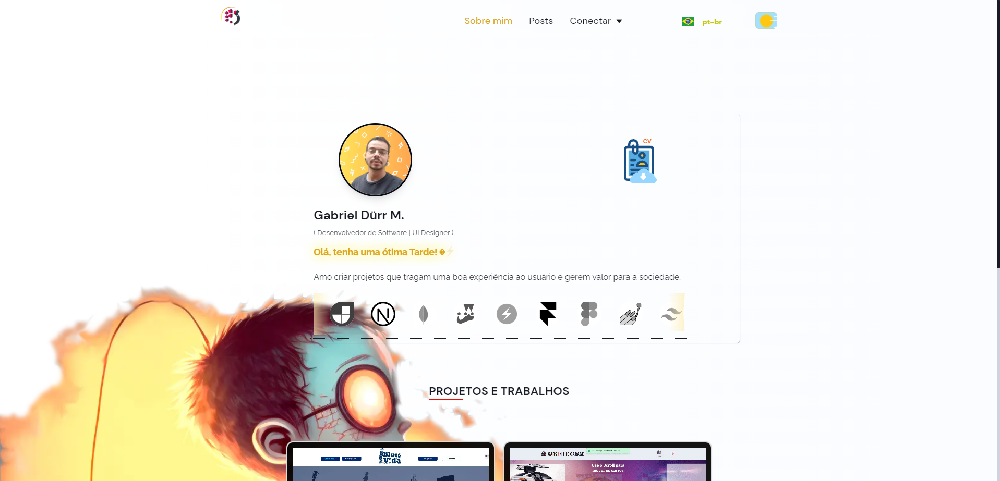

Portfolio pessoal <a href="https://cars-in-the-garage.netlify.app/" target="_blank">gabriel-durr V2</a>, feito com NEXT.js, TypeScript e outras techs.

<br/>



<br/><br/>

1- Irá realizar o clone e instalar as dependências e abrir o projeto no <b>VS Code</b> :

<br/>
  
```bash
 git clone https://github.com/gabriel-durr/gx-portfolio && cd gx-portfolio && npm install && code.
```

<br/>

2- Agora basta iniciar o server local com seguinte comando:

```bash
 npm run dev
```

<br/> <br/>

<table align="center">
  <tr>
      <td>
      <a href="https://github.com/gabriel-durr">
        <br>
      </a>
      </td>
  </tr>
</table>

<div align="center">
        <sub><b><em>Made with 💜&ensp; by Gabriel Dürr </em></b></sub>
</div>

<br/> <br/> <br/>

<div align="center">
        
<h3 id="license" ></h3>
