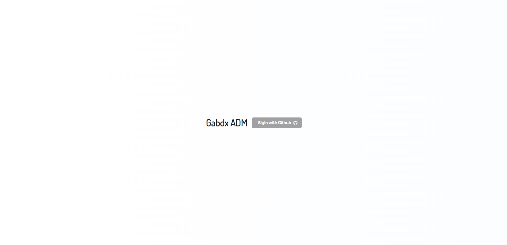
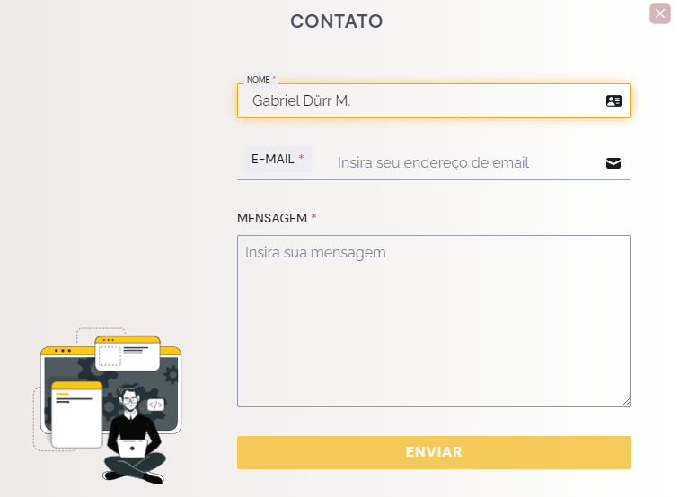
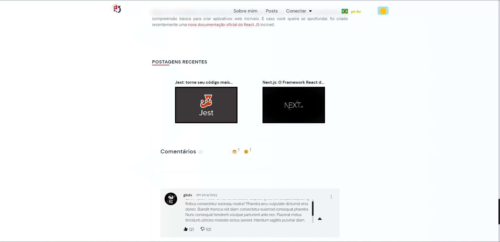
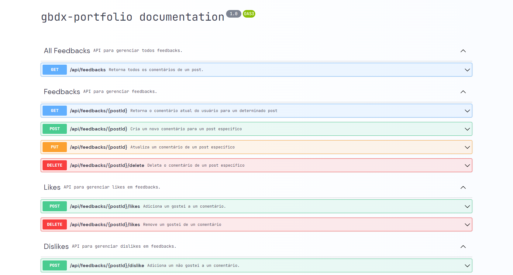

<h2 align="center">gbdx-portfolio V2</h2>

<br/>

<div align="center">
           
</div>

<br/>

<div align="center">
         
</div>

<br/><br/>

<div align="center">
       
     
</div>

<br/>

<div align="center"  class="links">
        <a href="#about">about</a> |
        <a href="#built_with">built with</a> |
        <a href="#api_doc">doc api</a> |
        <a href="#application_tests">application tests</a> |
        <a href="#author">author</a> |
        <a href="#links">Links</a> |
        <a href="#license">license</a> 
</div>

<br/> <br/>

<h2 id="about"  align="center">⚡ Sobre o Projeto </h2>

> <br/>

<br/> <br/>

Este é o projeto do meu site pessoal, onde compartilho alguns dos meus projetos, publico posts sobre ferramentas e tecnologia em geral e forneço informações de contato, entre outros recursos. O projeto é tematizado em torno de um cenário altamente tecnológico, que narra a história de um personagem em um mundo onde inteligências artificiais evoluíram ao ponto de desenvolver uma autoconsciência...

O projeto contém:

- Webhooks: (Criação de collections automáticas no banco de dados MongoDB quando uma nova Postagem criada no HeadlessCMS; Revalidação de página estática, fazendo uma build da página com projeto em produção; Notificações SMS quando um novo comentário ou denúncia de comentário é criada)
- Painel administrativo: Criado para gerenciamento e controle dos comentários criados, com base na localização para verificar se há algum tipo de SPAM, etc. Além da possibilidade excluir qualquer comentário e até mesmo proibir uma localização de criar comentários. Visualização e tratamento de denúncia feita á comentários.
- Documentação de algumas das rotas da API, sendo possível fazer visualizar a documentação em um objeto JSON através de uma uma request ou página, sendo possível testar as rotas, etc.
- Chatbot: Criei um chatbot para treinando um modelo de IA personalizado, através do <a href="https://swr.vercel.app/pt-BR" target="_blank"> Fine-tuning</a> da Openai. Criei algumas dezenas de inputs, porém é necessário criar mais, e criar algumas regras e restrições para o modelo, porém no momento minha conta atingiu o limite de tokens, e assim que possível trabalhei mais o modelo.
- Projetos: Disponibilização de projetos pessoas e profissionais criados.
- Posts: Postagens referente a área de programação e Design.
- Contato: Mídias Sociais, e contato através de um formulário.

</br>
  
  Entre outras funcionalidades.., clique no link abaixo para conhecer o meu trabalho, estou disponível caso queira falar sobre o projeto ou oportunidades na criação ou colaboração de projetos existentes ❣️

<br/><br/><br/>

<h2 id="deploy"> ☁️🌌 Deploy</h2>

<br/>

O site tem um ótimo <b>SEO</b>, então você pode acessar pesquisando por: <a href="https://www.google.com/search?q=gabriel+durr&rlz=1C1FCXM_pt-PTBR1001BR1001&oq=&aqs=chrome.0.69i59i450l8.655563244j0j15&sourceid=chrome&ie=UTF-8" target="_blank"> Gabriel Durr</a> ou acesse diratamente <a href="https://www.gabrieldurr.site/" target="_blank"> Clicando aqui</a>.

<br/><br/>

<br/><br/>

<h2 id="built_with"> 🧙‍♂️ Feito Com</h2>

<br>

<div align="center" class="container-icons">

<p float="left">


</p>
        
</div>

<br/> <br/> <br/> <br/> <br>

<h2 id="api_doc"> 📖 Documentação da API</h2>

<br/><br/>

<div align="center">

<a href="https://www.gabrieldurr.site/" target="_blank"><b> Página da documentação </b></a> ou <a href="https://www.gabrieldurr.site/api/doc" target="_blank"><b>Objeto JSON da documentação</b></a>

         
</div>

<br/> <br/> <br/> <br/> <br>

<h2 id="links"> 🔗 Links Úteis</h2>

> <h2> Iniciando o Projeto </h2>

<br/> <br/>

1- Irá realizar o clone e instalar as dependências e abrir o projeto no <b>VS Code</b> :

<br/>
  
```bash
 git clone https://github.com/gabriel-durr/gx-portfolio && cd gx-portfolio && npm install && code.
```

<br/>

2- Agora basta iniciar o server local com seguinte comando:

```bash
 npm run dev
```

<br/> <br/> <br/> <br/>

<h2 id="application_tests"> 🧪⚗️ Testes realizados</h2>

<br/>

<b>Foram realizados testes unitários nos seguintes components:</b>

[x] Header <br/>
[x] Curriculum <br/>
[x] Dark Mode <br/>
[x] Contact Form <br/>
[x] Lang Switcher

<br/><br/>

<b>Para executar os testes: </b>

<b/>

```bash
 npm run test
```

<br/><br/>

Framer Motion é uma biblioteca de movimento simples, porém poderosa, para React. Ele potencializa as incríveis animações ... <a href="https://www.framer.com/motion/" target="_blank">Clique para ser redirecionado!</a>

<br/>

Com Next.js, você pode construir interfaces de usuário usando componentes React. Em seguida, o Next.js fornece estrutura, recursos e otimizações adicionais para seu aplicativo.... <a href="https://nextjs.org/docs" target="_blank">Clique para ser redirecionado!</a>

<br/>

O nome "SWR" é derivado de stale-while-revalidate, uma técnica de invalidação de cache ... <a href="https://swr.vercel.app/pt-BR" target="_blank">Clique para ser redirecionado!</a>

<br/>

Mongodb: A plataforma de dados do desenvolvedor que fornece os serviços e as ferramentas necessárias para criar aplicativos distribuídos rapidamente ... <a href="https://www.mongodb.com/" target="_blank">Clique para ser redirecionado!</a>

<br/> <br/> <br/>

<h5 id = "author" align="center"></h5>

<table align="center">
  <tr>
      <td>
      <a href="https://github.com/gabriel-durr">
        <br>
      </a>
      </td>
  </tr>
</table>

<div align="center">
        <sub><b><em>Made with 💜&ensp; by Gabriel Dürr </em></b></sub>
</div>

<br/> <br/> <br/>

<div align="center">
        
<h3 id="license" ></h3>

> This project is licensed under the &nbsp; [](LICENSE)

</div>
